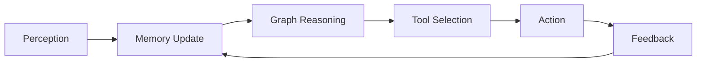

# Agentic AI
## Agentic AI : Agent anatomy with knowledge graphs 
### Tools, Reasoning & Memory

---

## The LLM Reality Check

- **The Dream**: One magical prompt → Complete solution
- **The Reality**: LLMs can describe but cannot act
- **The Gap**: Generate perfect email ≠ Send email

> Agents wrap and extend LLMs with real capabilities

---

## Three Pillars of Agent Autonomy

### 🔧 Actions
Tools & Execution

### 🧠 Memory
Context & Learning

### 💭 Reasoning
Decisions & Logic

---

## Pillar 1: Actions & Tools
### Giving Agents "Hands"

- **Problem**: LLMs can't take real actions
- **Solution**: Tool integration
- **Challenge**: Tool selection & orchestration

---

## The Tool Challenge

### Humans vs AI
- **Human**: 55 ways to use a hammer
- **AI**: Hammer = nail (only)

### Tool Overload
- Too many tools → Analysis paralysis
- No creative repurposing
- Rigid descriptions limit flexibility

---

## Knowledge Graph Solution
### Hierarchical Tool Organization

```
Communication Tools
    ├── Email Tools
    │   ├── Gmail API
    │   └── Outlook API
    └── Messaging Tools
        ├── Slack API
        └── Teams API
```

**Benefits**: Smart selection, context filtering, fallback strategies

---

## Pillar 2: Memory
### From Stateless to Contextual

| Type | Purpose | Example |
|------|---------|---------|
| **Operational** | Current tasks | Active conversation |
| **Long-term** | Persistent knowledge | User preferences |
| **Sensory** | Input processing | API responses |

---

## Graph-Powered Memory

### Why Knowledge Graphs?

- **Semantic Organization**: Connected concepts, not isolated facts
- **Scalable**: Millions of nodes, fast queries
- **Contextual**: Retrieved info includes relationships
- **Temporal**: Understands sequences & causality

---

## Pillar 3: Reasoning
### Beyond Pattern Matching

### LLM Limitations
- ❌ No formal proofs
- ❌ Inconsistent logic chains  
- ❌ Can't handle uncertainty
- ❌ Multi-step deduction fails

### Graph Solutions
- ✅ First-order logic rules
- ✅ Path-based reasoning
- ✅ Constraint satisfaction
- ✅ Verifiable inference

---

## Knowledge Graphs Enable

<div style="font-size: 0.9em;">

### 🔧 Tool Selection
- Hierarchical navigation
- Capability matching
- Smart substitution

### 🧠 Memory Architecture  
- Semantic storage
- Pattern extraction
- Context preservation

### 💭 Reasoning Power
- Logic rules on graphs
- Transparent decisions
- Compositional thinking


---

## The Integrated Decision Loop



**Knowledge Graph = Central Nervous System**

---

## Real-World Impact

### Without Agents
- ChatGPT writes perfect email
- Human sends it manually
- No follow-up tracking

### With Graph-Empowered Agents
- Agent writes email
- Selects email tool from graph
- Sends, tracks, schedules follow-up
- Learns from response patterns

---

## Implementation Strategy

1. **Start Small**: Minimum viable ontology
2. **Build Core**: Domain-specific knowledge graph
3. **Add Tools**: Hierarchical tool registry
4. **Enable Memory**: Multi-tier storage
5. **Layer Reasoning**: Rules + ML hybrid
6. **Iterate**: Learn from usage patterns

---

## Current Challenges

### Technical
- Graph scalability (billions of nodes)
- Real-time processing
- Distributed consistency

### Practical  
- No standards for tool descriptions
- Ontology alignment
- Benchmarking complexity

---

## The Future

### From LLM to Agent
- **Yesterday**: Generate text
- **Today**: Execute actions
- **Tomorrow**: Autonomous problem-solving

### Knowledge Graphs Are The Key
- Structure meets flexibility
- Logic meets learning
- Transparency meets capability

---

## Key Takeaway

> **LLMs provide the language understanding**
> 
> **Knowledge Graphs provide the structure**
> 
> **Together, they enable true autonomy**

### The three pillars—Actions, Memory, and Reasoning—unified through graphs, transform AI from assistant to agent

---

## Questions?

### Learn More
[Agentic AI: Agent Autonomy — Tools, Reasoning and Memory with Graph Empowerment](https://medium.com/ai-in-plain-english/agentic-ai-agent-autonomy-tools-reasoning-and-memory-with-graph-empowerment-5790336ffc3c)
**Thank you!**