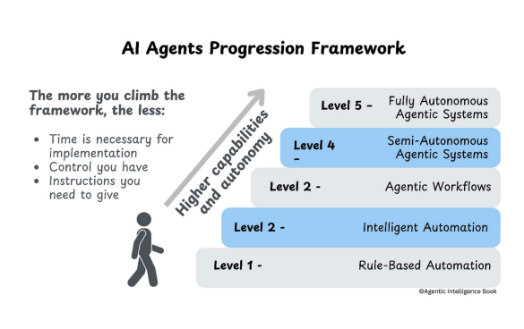

# AI Agent Autonomy
## Understanding the Spectrum of Intelligence

---

## The SPAR Framework

**How AI Agents Take Action:**

- **Sense:** Gather data from multiple sources, detect changes, maintain context awareness
- **Plan:** Engage in sophisticated reasoning to develop step-by-step plans and coordinate resources  
- **Act:** Use available tools to carry out actions like sending messages, updating systems
- **Reflect:** Learn and adapt from experience, analyze performance, refine approaches

*The SPAR cycle enables agents to operate autonomously by continuously sensing, planning, acting, and reflecting.*

---

## What is AI Agent Autonomy?

**Autonomy** refers to an AI agent's ability to:

- **Act independently** without constant human intervention
- **Make decisions** based on environmental feedback
- **Adapt strategies** to achieve goals
- **Learn and improve** from experience

The more autonomous an agent, the less human oversight it requires.

---

## The Autonomy Framework

**Higher levels = Greater autonomy**

---

## Autonomy as Design Choice

Designing AI systems requires **intentional decisions** about autonomy level:

**Business Considerations:**
- Risk tolerance and safety requirements
- Regulatory compliance needs
- User trust and acceptance

**Technical Constraints:**
- Available data and compute resources
- System complexity requirements
- Integration capabilities

---

## Level 0: Manual Operations
### Human-Only

**AI Agent Analogy:** A basic calculator - requires human input for every operation

**Key Characteristics:**
- Humans perform all tasks without automation
- Basic digital tools (spreadsheets, email)
- Manual processing only

**SPAR Capabilities:** Not Applicable

---

## Level 1: Rule-Based Automation
### Simple Automation

**AI Agent Analogy:** A chatbot with predefined responses - follows scripts but can't adapt

**Key Characteristics:**
- Simple automation follows fixed rules
- Basic automation tools (RPA, simple scripts)
- Predefined triggers and structured data

**SPAR Capabilities:**
- **Sensing:** Predefined triggers
- **Planning:** Simple if-then rules
- **Acting:** Deterministic actions
- **Reflecting:** Basic logging only

---

## Level 2: Intelligent Process Automation
### Smart Automation

**AI Agent Analogy:** A smart email assistant - can categorize emails and suggest responses but needs approval

**Key Characteristics:**
- AI combines automation with cognitive abilities
- Machine learning, NLP, computer vision, RPA
- Semi-structured data from multiple sources

**SPAR Capabilities:**
- **Sensing:** Multi-source data processing
- **Planning:** Basic AI models for pattern recognition
- **Acting:** Sophisticated actions with error handling
- **Reflecting:** Performance monitoring, no adaptation

---

## Level 3: Agentic Workflows
### Reasoning Agents

**AI Agent Analogy:** A research assistant - can gather information, analyze data, and create reports but needs guidance on complex decisions

**Key Characteristics:**
- Agents generate content, plan, reason, and adapt
- Large language models, memory systems, content generation
- Advanced natural language understanding

**SPAR Capabilities:**
- **Sensing:** Advanced NLU and context awareness
- **Planning:** Foundation model reasoning and workflow orchestration
- **Acting:** Chaining tools and multi-step tasks
- **Reflecting:** Limited short-term feedback and long-term memory

---

## Level 4: Semi-Autonomous Agents
### Strategic Independence

**AI Agent Analogy:** A specialized AI consultant - operates independently in its domain of expertise, adapting strategies based on outcomes

**Key Characteristics:**
- Agents work autonomously within defined expertise
- Advanced reasoning, real-time adaptation, causal reasoning
- Multi-modal perception of diverse inputs

**SPAR Capabilities:**
- **Sensing:** Multi-modal perception and interpretation
- **Planning:** Dynamic strategies for complex tasks
- **Acting:** Autonomous tool usage and error recovery
- **Reflecting:** Context retention across sessions, learns from experience

---

## Level 5: Fully Autonomous Agents
### Complete Independence

**AI Agent Analogy:** An AI scientist - can conduct research, form hypotheses, design experiments, and discover new knowledge across any domain

**Key Characteristics:**
- AI systems handle any task, cross-domain learning
- Sophisticated memory systems, advanced learning mechanisms
- Complete environmental awareness

**SPAR Capabilities:**
- **Sensing:** Complete environmental awareness and goal formulation
- **Planning:** Advanced reasoning and original problem-solving
- **Acting:** Full autonomy in tool selection and execution
- **Reflecting:** Continuous self-improvement, robust long-term memory

---

## Key Takeaways

**The Autonomy Spectrum:**
- Each level builds upon previous capabilities
- Higher autonomy = less human intervention required
- Design choice depends on specific use case needs

**Implementation Considerations:**
- Start with lower levels and gradually increase autonomy
- Balance capability requirements with risk management
- Consider user acceptance and regulatory constraints

---

## Thank You

**Questions & Discussion**

*Understanding AI agent autonomy helps us build more effective and trustworthy AI systems*