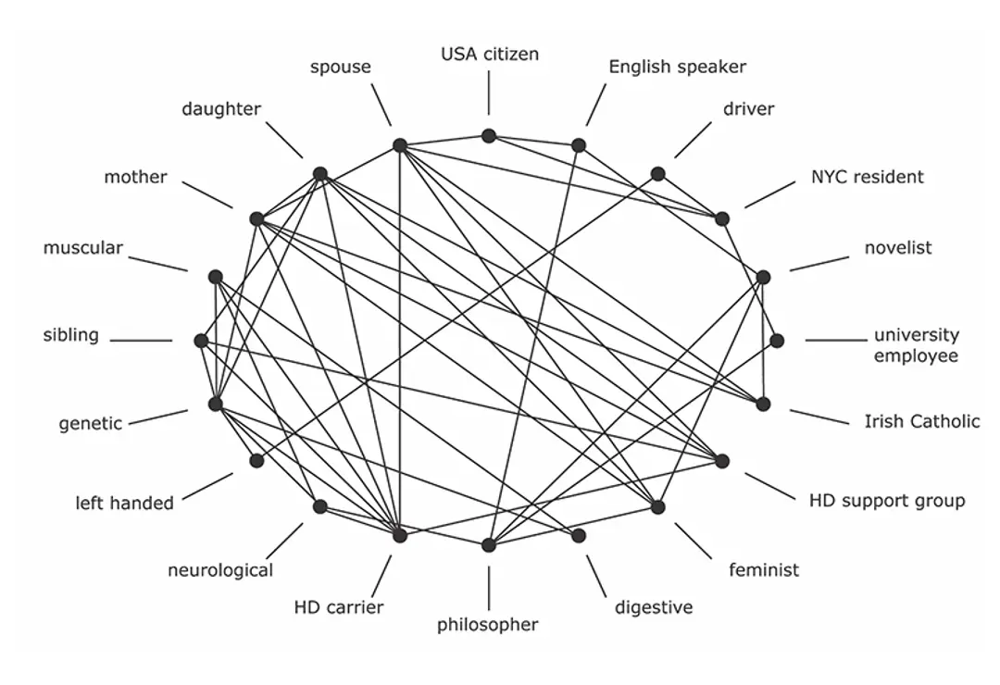
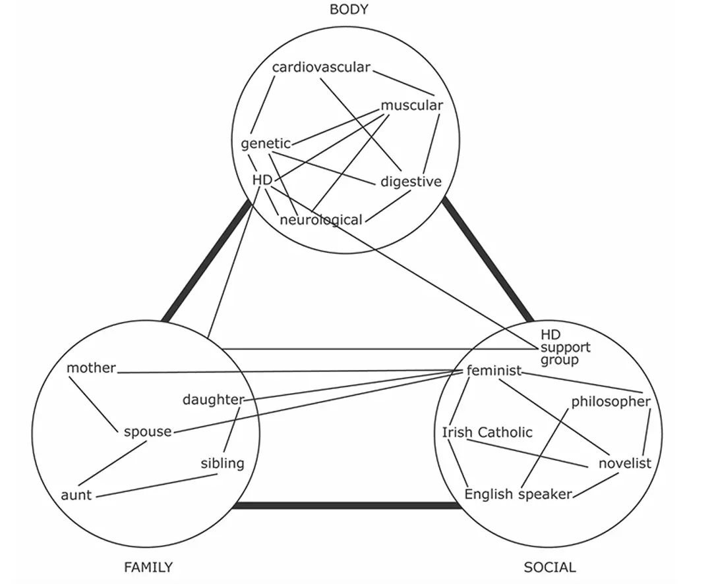

# Understanding Agent Identity
- What is AI Agent ?
- How identity work for Humans ?
- How it is looks like for AI Agents ?

---

### Agents are not new 
- John McCarthy (1960s) lisp programs that act on behalf of user 
- Carl Hewitt’s Planner (1969) Planing and Goal directed agents 
- Actor model (1973, Carl Hewitt) Agent 2 Agent interaction 

📌 Agents - preprogrammed entities 

---

### AI Agents 
- Natural Language use 
- Intelligence & Learning 
- Decision-Making Autonomy 
- Perception of Context 
- Goal Flexibility 

📌 [AI Agents - Humman like entities](https://medium.com/ai-in-plain-english/agents-are-more-human-like-entities-not-another-software-65bef1742d16)  

---

### From Task Execution to Autonomous Presence

- AI agents have evolving beyond task execution.
- Proactive role in communication 
- Identity now plays a foundational role in autonomy.

---

##  What *Is* Identity?

### Philosophical & Practical View

- Not just identifiers (e.g., names or UUIDs).
- Identity = behavior patterns, capabilities, expertise, interaction style.
- Influenced by context: same agent, different settings → different expressions.

---

## Network of Identities 

[network of identities persona](https://aeon.co/essays/the-self-is-not-singular-but-a-fluid-network-of-identities?source=post_page-----51e8736f8a7a---------------------------------------)

📌 Humans = network of  identities → so do agents.

---

## Trait driven identity 

📌 Humans has traits that shape identity.

---

##  Identity of Agents in AI-Native Companies

- **System prompts** are the blueprint of identity.
- Identity prompt = role, expertise +  style, behavior.

> "You are Ontology expert with 10+ years in knowledge graphs... use more formal language prefer RDF as to communicate results "

- It's more than configuration — it's **professional persona**.

---

##  Architecture Shapes Identity 

- **Model architecture** affects expressiveness.
- **Memory systems** impact coherence.
- **APIs/tools/resources** define capabilities.
- **Data access** shapes expertise.
- **complience of env** effect enterprice setup
 
💡 Identity = Prompt + Capabilities + Context + enviroment.

---

##  Multi-Agent Identity

### Focus Shifts: Who → What Can Be Done

- **Capability-centric** identity:
  - What services can the agent provide?
  - What skills are verified?

- **Personality traits** emerge in interactions.
  - Socratic vs. direct styles
  - Collaborative behavior

---

##  Emergent Identity in Collaboration

- **Identity emerges** through interactions:
  - Role (e.g., coordinator, specialist)
  - Autonomy level
  - Trustworthiness and reputation

- Agents adapt based on:
  - Operational context
  - Team structure
  - Communication patterns

---

## Trust, Verification & Credentials

- Can we verify agent claims?
- Need cryptographic proofs:
  - Digital signatures
  - Verifiable credentials
  - Audith logs
  - Organizational affiliation

🛂 Think: Agent CVs, reputation, and track records.

---

## Agent Identity Networks

- Agents = part of networks:
  - Other agents
  - Organizations
  - Resources

- Network effects:
  - Enhanced capabilities
  - Shared reputation
  - Collaborative identity

🔗 Relationships shape extended identity.

---

##  Cross-Network Identity

- Bridging identity across:
  - Organizations
  - Systems
  - Countries

- Requires:
  - Schema translation
  - Trust propagation
  - Semantic interoperability

🌐 Identity must travel.

---

##  Conclusion

- Agent identity is **multi-dimensional**:
  - Capabilities
  - Personality
  - Verification
  - Relationships
  - Context adaptation

- Identity isn’t optional — it’s **core infrastructure**.

🧭 For trusted, autonomous AI agents, identity is the anchor.

---

## Thank You!
To learn more: 
 [Agentic AI: What is Agent Identity About?](https://medium.com/ai-in-plain-english/agentic-ai-what-is-agent-identity-about-238b557b6224)

**Questions?**

